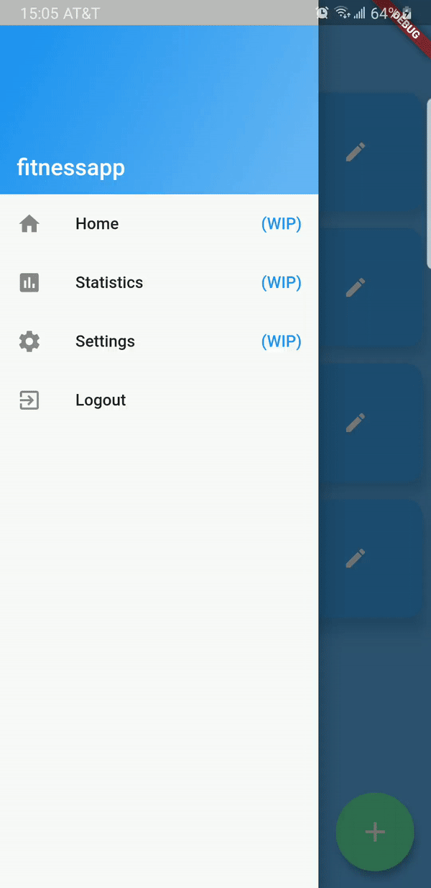

# fitnessapp
Fitnessapp (wip) is a workout log application designed to manage multiple user workout   
routines and to help visualize muscle progress and overall fitness statistics.  
*Fitnessapp integrates Firebase as it's back-end service to manage user accounts and store user data.*

Quick Registration         |  Manage Workouts          |    Visualize Progress
:-------------------------:|:-------------------------:|:----------------------------:
  |   | 

## Download & Installation

- The android .apk file is available for download [here](https://github.com/Kurt-Tito/fitnessapp/raw/master/build/app/outputs/apk/app.apk)  
- To install, transfer the file to an android device or emulator and open the file.  
- *NOTE: Make sure to enable third party apps to continue the installation*

### Future Plans & To-Do List
1. Code refactoring & modularization
2. Implement a "start routine" feature where the user can log their sets, reps, and weight
3. Re-design UI for login and register page
4. Remove home from app drawer / Implement app drawer's statistics, and settings
5. Deploy application to Play Store and/or App Store

